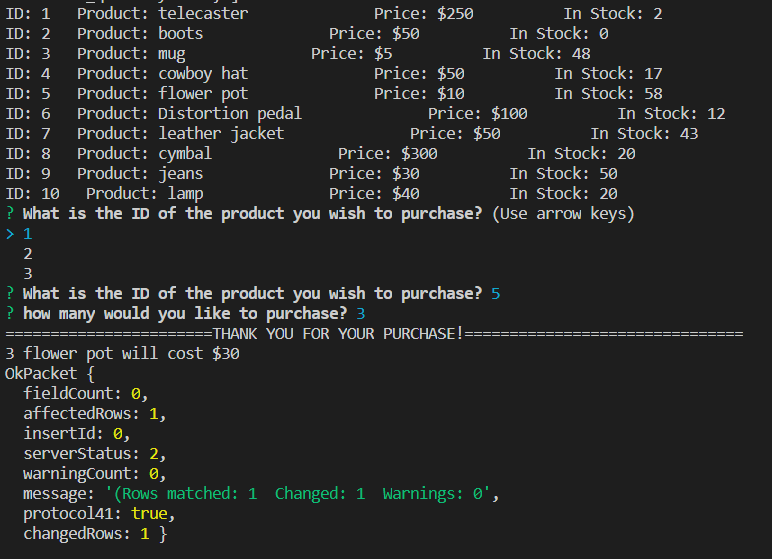
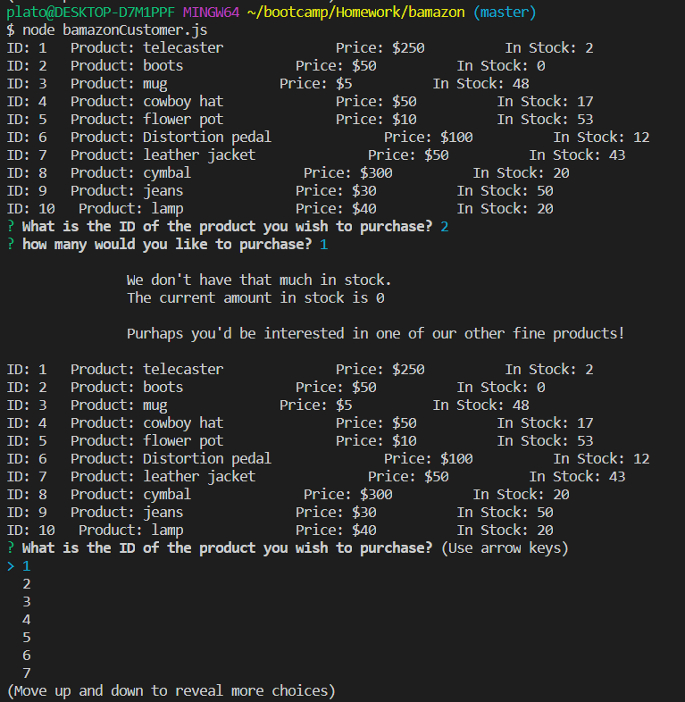

# Bamazon
Week 12 Homework: Mock Amazon Store Front

This weeks enterprise was creating a Command Line Interface that would function as a store front. After showing the availible products for sale the user was then asked to select one of the products for purchase. Upon their selection the user was then asked to enter the quanitity of the product they wished to purchase. If there was a sufficient quantity in the store to fufill their request they were thanked and given the total cost of the purchase. However if there was an insufficient quantity and the store was unable to make the request the customer was made aware of this and prompted to choose another product for sale, and the process began over again.

## How it works!

- Products Name, Id, Price and Quantity are stored in a table on a MYSQL Database.
- The database is connected to through Node.js and the data from the table is stored in an array as a variable
- The array is entered into a function as a parameter where it is looped over and displayed to the user.
- The User is then prompted to choose from one of the products in the list then type in the amount they wish to purchase.
- An "if else" statement is used to evaluate whether it is a valid order and if it is the database is called and the stock quantity is updated to reflect amount after the sale.

# Here's a photo of the CLI making a Successful Purchase

### As the Okpacket indicates the new quantity has been updated in the database.

# This is an Example of a purchase where the desired quantity exceeds the amount in stock.

# Reflections
The bulk of the functionality came fairly quickly, a similar amount of time was spent fine tweaking the code making it more presentable. I spent a good deal of time unsuccesfully trying to show the updated stock after the purchase. Even though that wouldn